# TrackBallBar ホイール／キー拡張ユニット
ホイール／キー拡張ユニットは、TrackBallBarに、
2つのホイールと4キーを追加するユニットです。

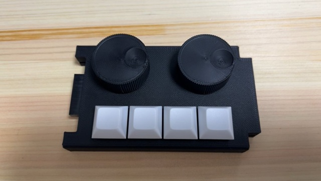
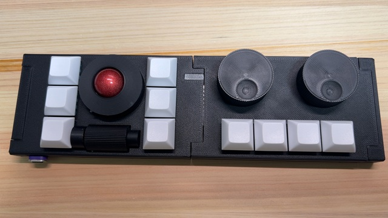

## 特徴
- 2つのホイール(スイッチ付)と4キーを追加するユニットです。
- MX互換キースイッチが使用できます。
- 接続コネクタが左に１，右に１あります。
- はんだづけが必要なキットとなります。

## パッケージ内容
- ホイール／キー拡張ユニットケース
- コネクタキャップ(左)×1
- コネクタキャップ(右)×1
- ロータリーエンコーダ用ホイールx2
- コネクタ取り付け用治具×2
- ホイール／キー拡張ユニット基板
- 24クリックプッシュスイッチ付き20mmロータリーエンコーダ(EC12互換)x2
- Yushakobo Fairy Silent Linear Switch(MX互換静音キースイッチ 35g)x4
- DSAキーキャップ 白x4
- 2x10(20)ピンソケット×1
- 2x10(20)ピンヘッダ×1
- M3ラミメイトネジ×4
- ガスケット(外径7mm、内径3mm、厚2mm)×4

## 別途必要な物
- はんだこて
- はんだ

## はんだづけ作業
- 54ピン(20ピンソケットx1、20ピンヘッダx1、7ピンロータリエンコーダx2)

## サイズ
- 幅: 112mm
- 奥行: 64mm
- 高さ: 27mm(ホイール含む)

## 使用上の注意
- ケースやホイールは3Dプリンターによる自家製です。細かい傷などありましても、ご容赦ください。
- ケースやホイールはPLAで作成しています。50度ほどで変形しますので、温度には注意してください。

## 組み立て手順
1. ピンソケットにピンヘッダを差し込みます。 
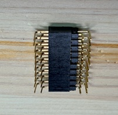
2. 基板の表側の右に1のピンヘッダを差し込みます。
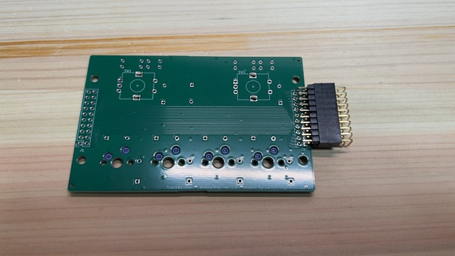 7jhnj
3. コネクタ取り付け用治具を基板のコネクタのあたりにはめます。 
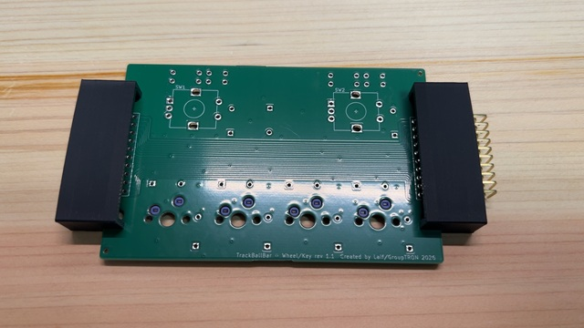
4. 基板を裏返しにします。 
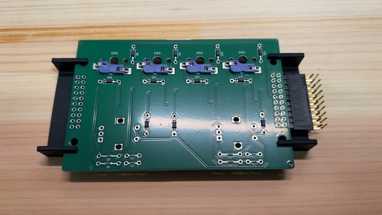
5. ピンソケットが治具に水平に載るように調整してから、はんだづけします。
6. ピンソケットを外します。
7. 基板の表側の左にピンソケットを差し込みます。 
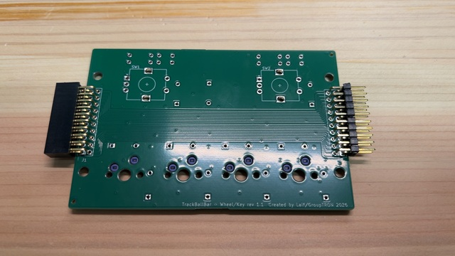
8. コネクタ取り付け用治具を基板のコネクタのあたりにはめます。 
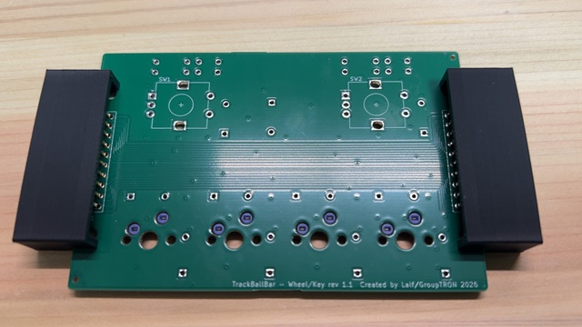
9. 基板を裏返しにします。 
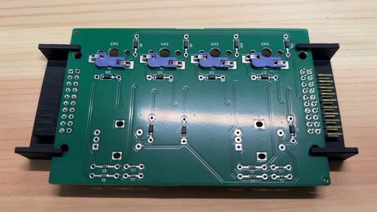
10. ピンソケットが治具に水平に載るように調整してから、はんだづけします。
11. 基板の表側にロータリーエンコーダを２つ差し込みます。 
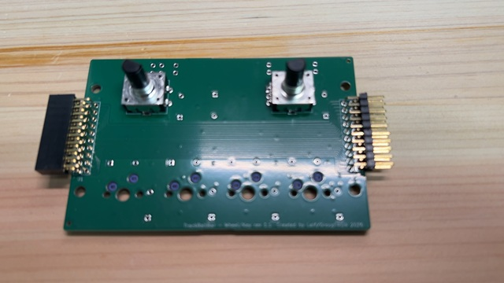
12. 基板を裏返しにします。 
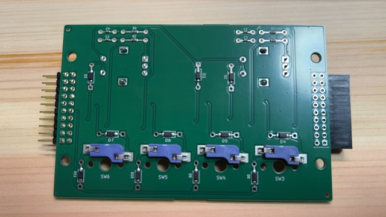
13. ロータリーエンコーダをはんだづけします。
14. ケースの底板のネジ穴4か所に、(気休めの)ブラケットを載せます。 
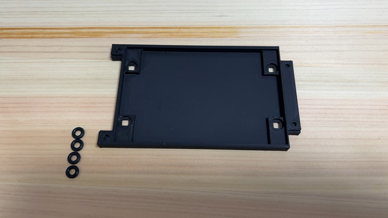
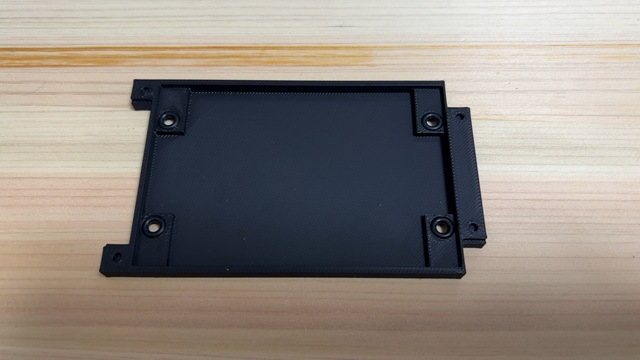
15. ケースの底板に基板を載せます。 
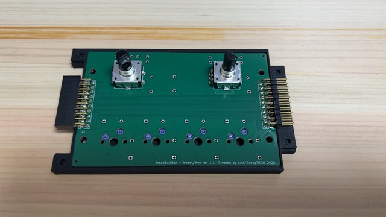
16. ケースの上板をかぶせます。 
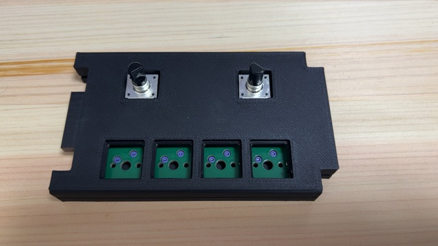
17. ケースを裏返しにし、ねじどめします。 
注意：ナットを使わず、3Dプリントしたケースに直接ねじどめするため、あまり強く締めないでください。 
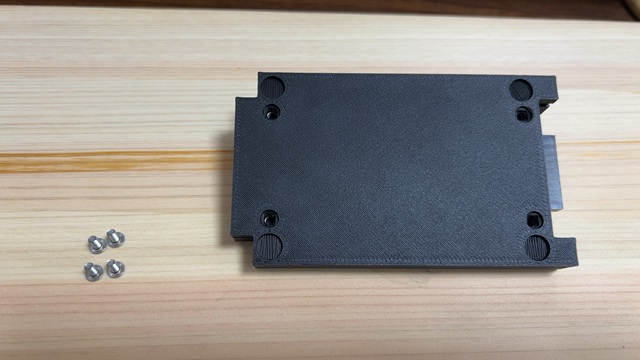
18. 裏返し、キースイッチを付けます。 
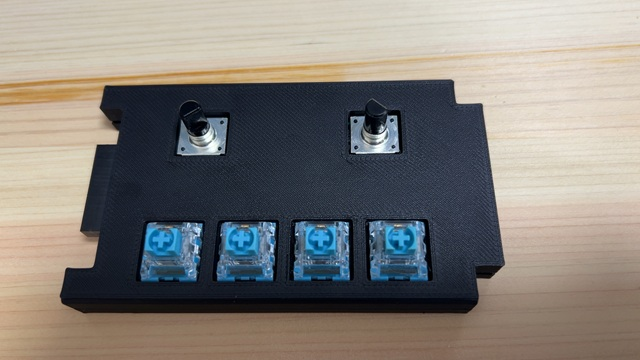
19. キーキャップを付けます。 
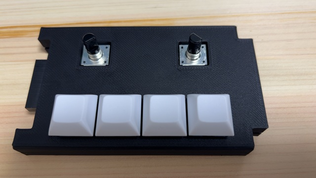
20. ロータリエンコーダ用ホイールを付けます。 

## キーマップ
vialでのキー位置は以下になります。 
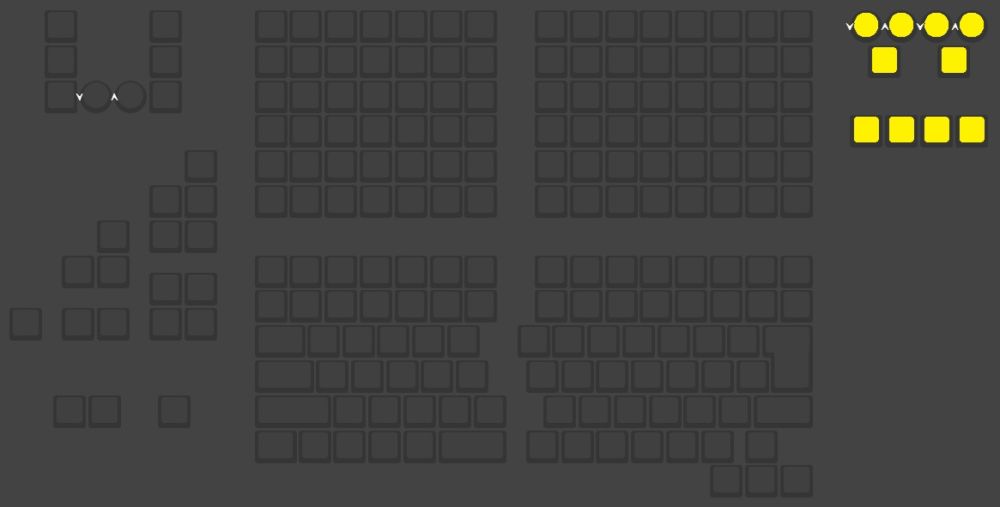

## 回路図
[回路図(PDF)](imgs/wheelkey-rev1.1.pdf)